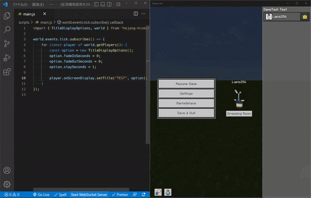
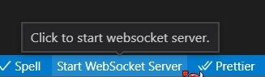
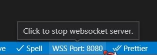

# Minecraft Auto Reloader
**This document has been translated from Japanese to English using Google Translate.**

This extension makes it easier to debug add-on development for Minecraft Bedrock Edition.



## How to use
1. The extension is enabled by opening the Behavior Pack folder.
2. Run the `minecraft-auto-reloader.startServer` command or click on the shortcut below to start the websocket server.

3. Run the `/connect localhost:<port number>` command within Minecraft to connect to the websocket server. You can check the port number from the shortcut below.

4. It automatically reloads every time you update a file with the extension js or json or mcfunction in the scripts folder or functions folder.

## Installation
Press `ctrl + p` in vscode and type` ext install Lapis256.minecraft-auto-reloader`

## Troubleshooting
- **Unable to start websocket server**
  - Change the port number from the settings.
- **Unable to connect to websocket server**
  - Execute the following appropriate command at the command prompt opened with administrator privileges.
    - Release version: ```CheckNetIsolation LoopbackExempt -a -n="Microsoft.MinecraftUWP_8wekyb3d8bbwe"```
    - Preview version: ```CheckNetIsolation LoopbackExempt -a -n="Microsoft.MinecraftWindowsBeta_8wekyb3d8bbwe"```

## Attribution
- Icon [Sync icons created by ultimatearm - Flaticon](https://www.flaticon.com/free-icons/sync)